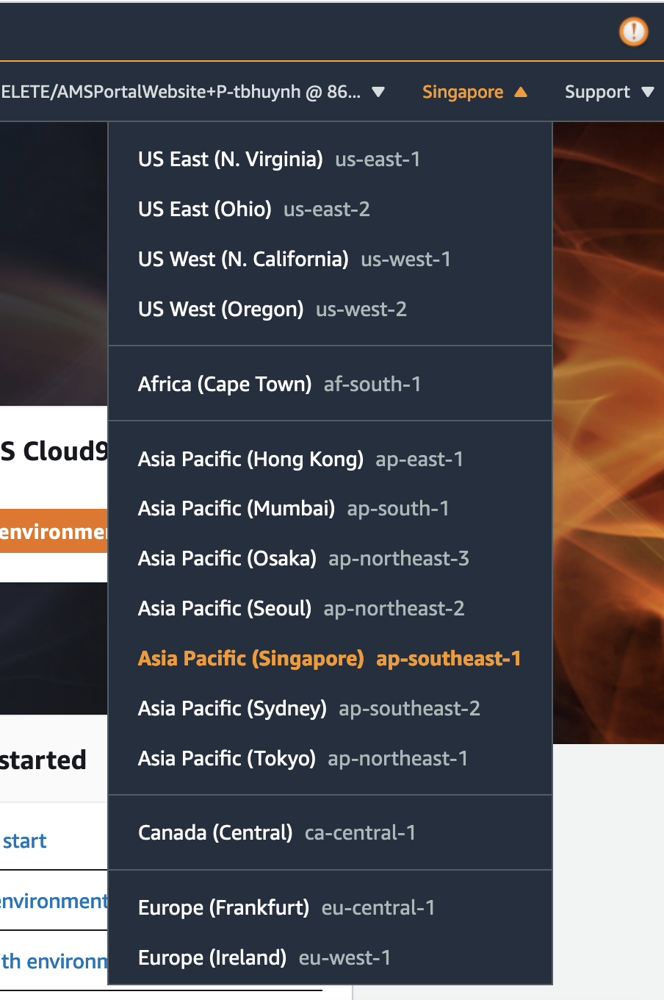
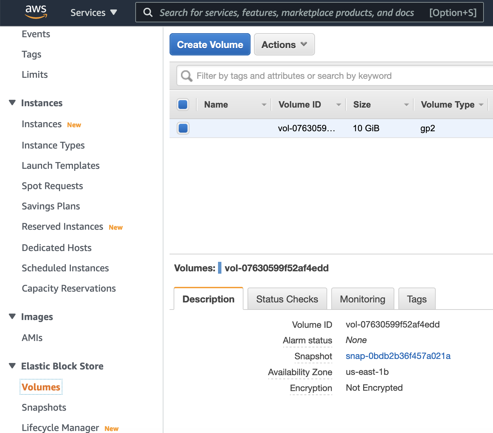
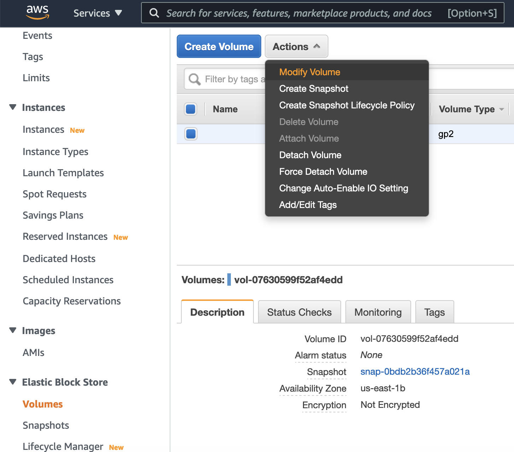
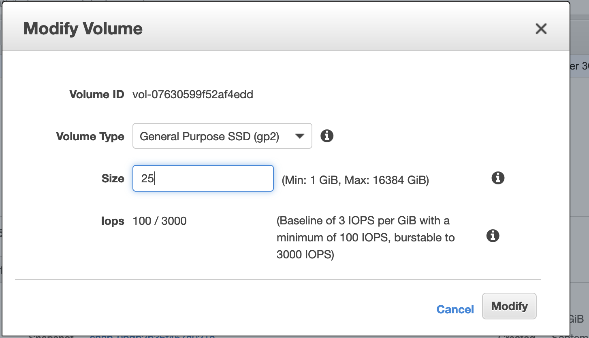

# Module 2: Create Cloud9 IDE environment

AWS Cloud9 is a cloud IDE accessed from your web browser. It comes prepackaged with essential tools for [many popular programming languages](https://docs.aws.amazon.com/cloud9/latest/user-guide/language-support.html). But what sets it part from other editors is its powerful pair programming features for ease of collaboration. Read more about cloud9 in this [blog](https://aws.amazon.com/blogs/aws/aws-cloud9-cloud-developer-environments/)

## Instructions

1. Go to the Cloud9 management console [link](https://ap-southeast-1.console.aws.amazon.com/cloud9/home?region=ap-southeast-1)  

1. Make sure you are in the the same region with s3 bucket in step 1.

	

1. Click **Create environment** 

1. For **Name**, use `<your-username>-workspace`. For example, `aws-batch-cloud9-workspace`, click **Next step** 

	

1. For **instance type**, pick **t2.small**. Leave the rest as default, then click **Next step** 

	

1. Review the settings and click **Create environment**

1. Increase volume size of Cloud9, go to EC2 management console, then select Volumes of Elastic Block Store

	

	Select appropriate volume, and select Modify Volume from **Actions** menu as below

	

	Increase the volume size, and click **Modify**

	

1. You should now be redirected to the new IDE environment!  

## Next step

Move on to [**Module 3: Running the code in the Cloud9 IDE**](./Module3.md)
