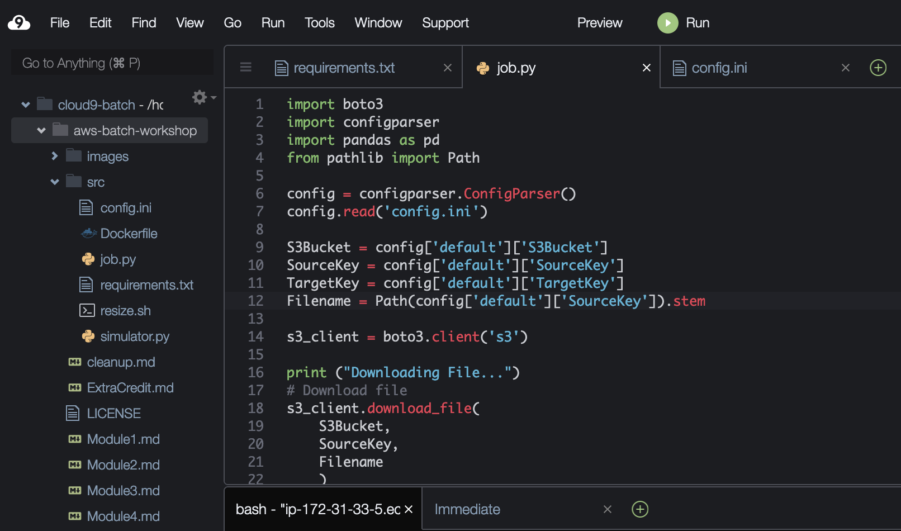
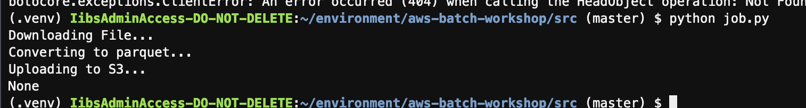
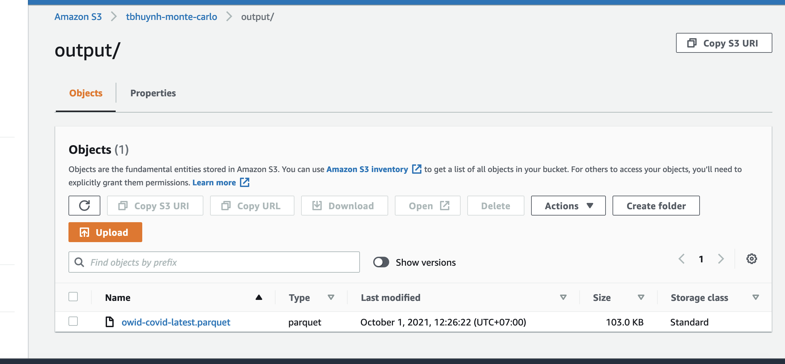

# Module 3 : Running the code in the Cloud9 IDE

In this module, you will use the Cloud9 IDE to download the simulation code and running the application locally in the IDE. 

As an optional step, you can test out Cloud9's debugging features

## Instructions

1. In the terminal window of the cloud9 environment, run the below to clone the github repo:

	```bash
	 git clone https://github.com/huynhbaotoan/aws-batch-workshop
	```
	
1. Enter the downloaded directory with 

	```bash
	cd aws-batch-workshop
	```
	
1. By default, Cloud9 uses python 2.7. Run the following the terminal to create a virtual environment for python 3.7. (There are also many other benefits of using [virtualenv](https://virtualenv.pypa.io/en/stable/) in managing python dependencies. )

	```bash
	unalias python
	virtualenv -p /usr/bin/python3.7 .venv
	source .venv/bin/activate
	```
	
1. Now if you check the python version by typing `python --version`, you should see something like this in the result:
	
	```
	(.venv) admin:~/environment/aws-batch-workshop (master) $ python --version                          
	```
	
1. Now take a look at the main source code file, `job.py` in the `src/` folder. 

	To do this, you can use the code editor of the Cloud9 IDE. Go to the left hand **Environment** tool bar, click into the `aws-batch-workshop` folder, and then into `src`
	
	
		
1. As you can see in the beginning of the file, multiple external libraries such as `pandas` and `boto3` are used in the code. We need to install the dependencies so we can run the code locally

	The required libraries are listed in `requirements.txt`, also in the `src` folder
	
	Back to the terminal window at bottom of screen, install the required dependencies by typing:
	
	```
	cd src/
	pip install -r requirements.txt 
	```

1. You are now ready to run the code locally! 

	As you can see in the `job.py` code, you need to get configuration values from config.init file. Therefore, you need to update the file with the appropriate values:
	```
	[default]
	S3Bucket = <your-s3-bucket-name>
	SourceKey = raw/<csv-file>.csv
	TargetKey = output/
	```
	Before running the script, you need to upload a CSV file to your bucket.
	You can run this program by trying the following in Cloud9 terminal:
	
	```
	python job.py
	```

	You should see the result of the job run like this. 

	
	
	you can check output folder in S3 bucket to see the generated file: 

	
	
## Next step

Move on to [**Module 4: Build a docker container**](./Module4.md)
