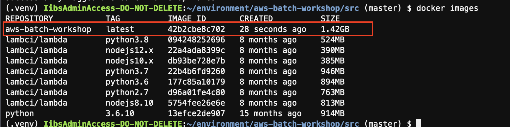
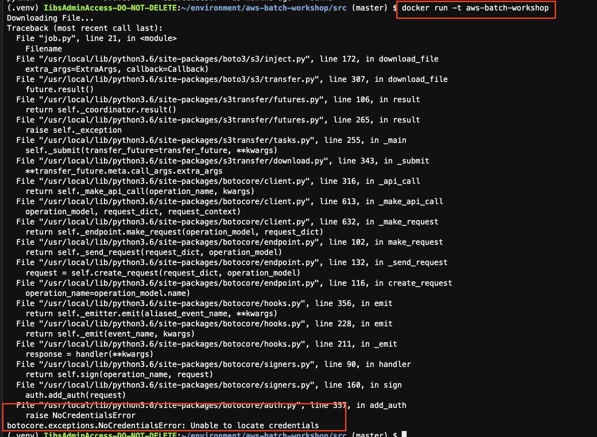
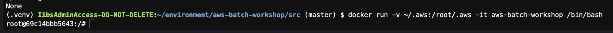

# Module 4: Build a docker container

Now we have tested the application, it's time to build a docker container! 

To build a docker container, we need to use a **Dockerfile** which is in src folder. See more reference on Dockerfile [here](https://docs.docker.com/engine/reference/builder/#environment-replacement)

## Instructions 

1. In the terminal:

	Ensure you are in the `src/` directory:

	```
	cd ~/environment/aws-batch-workshop/src
	```

	Build the docker image with tag `aws-batch-workshop`
	
	```
	docker build -t aws-batch-workshop .    
	```
	
1. You should now see your newly built docker image by running:

	```
	docker images
	```

	

1. You can run the docker image locally by 

	```
	docker run -t aws-batch-workshop
	```
	
	When you don't specify additional commands, the container will run the `CMD` argument specified in our **Dockerfile** by default. When it's done executing all the commands, the container will exit.

	However, you will receive the error as below:

	

	This is because the S3 SDK is trying to look for credentials to sign the request with. Typically in a dev environment, your credentials are stored in `~/.aws` folder, but your container doesn't have access to it. 
	
	Add the `-v ~/.aws:/root/.aws` flag to the command like below to mount the `~/.aws` folder from the host machine into the `/root/.aws` folder in the container:
	
	```
	 docker run  -v ~/.aws:/root/.aws  -t aws-batch-workshop
	```
	
	Luckily, when you run the container using AWS Batch, the credential problem is automatically handled by assigning an IAM role to the container. See more info on that [here](https://docs.aws.amazon.com/AmazonECS/latest/developerguide/task-iam-roles.html)
	
	
1. You can run the container and get interactive shell access to it:

	```
	docker run -v ~/.aws:/root/.aws -it aws-batch-workshop /bin/bash
	```
	
	For example: 
	
	

	To exit out of the interactive bash, type: 
	
	```
	exit
	```	

## Next step

Move on to [**Module 5: Push the docker container to Amazon ECR**](./Module5.md)
