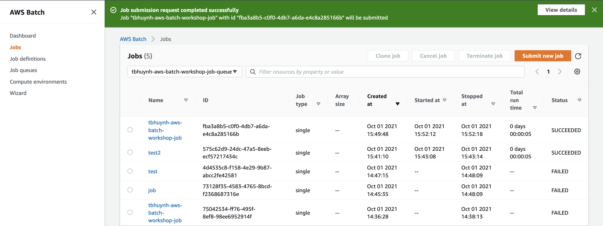

# Module 7: Create AWS Batch job 

In this section, we will use the AWS batch first run wizard to walk through:

* Create a job queue
* Create a managed compute environment (infrastructure that containers will run on)
* Create a job definition 
* Submit batch job

## Instructions

1. Click [here](https://ap-southeast-1.console.aws.amazon.com/batch/home?region=ap-southeast-1#/wizard) to go to the AWS Batch wizard 

1. Make sure **On-demand** radio button is selected, and input the compute environment name, click **Next**

	

1. In the page **Create a job queue**, create a new job queue:

	* **Job queue name**: `<your-username>-aws-batch-workshop-job-queue`
 
 	

1. In the page **Create a job definition**, create a new job definition as below

	* **Job definition name**: `<your-username>-aws-batch-workshop-job-definition`
	* Under **Container properties**, for **container image** field, fill in the URI of container repo you have created in Module 5:
	
		It should be in the format of `<account-id>.dkr.ecr.<region>.amazonaws.com/<your-username>-aws-batch-workshop`

	

	Under **Container properties**, expand **Additional configuration**
	- **Job role**: Pick the role you just created in module 6
 
 	

	Click **Next**

1. In the page **Create a job**, create a new job as below and go **Next** 

	* **Job run-time name**: `<your-username>-aws-batch-workshop-job`
	* For the **Command** to run, put in the following: 	
	```
	python job.py
	```
	
	

1. Finally, click **Create**
 
1. You now have created 

	* A job queue
	* A managed compute environment (infrastructure that containers will run on)
	* A job definition 
	* And your first AWS Batch job is just submitted! 

	
1. Go to **Dashboard** to see your job getting run. 

1. First time the jobs are run will take a little more time (several few minutes) before the jobs go into a **RUNNING** state, because AWS Batch needs to spin up some EC2 instances to run your containers. Using a Managed compute environment with AWS Batch mean it will automatically scale up and down the EC2 instances that will be used to run your containers. 

1. Click on the running/succeeded job to view the details: 

	

	By clicking into the job IDs, you can see more details of the job run. You can find the execution logs, start and end time, etc. in the **Attempts** section. 
	
	
	

 Thankfully, AWS batch provides an easy mechanism to enable job retries! 
 
 Go to [**next module**](./Module8.md) to learn how to make your batch jobs more resilient to failures! 